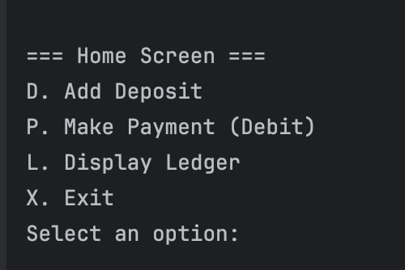
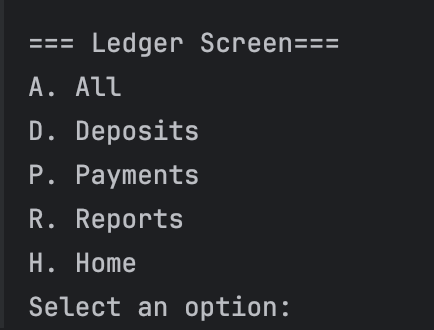
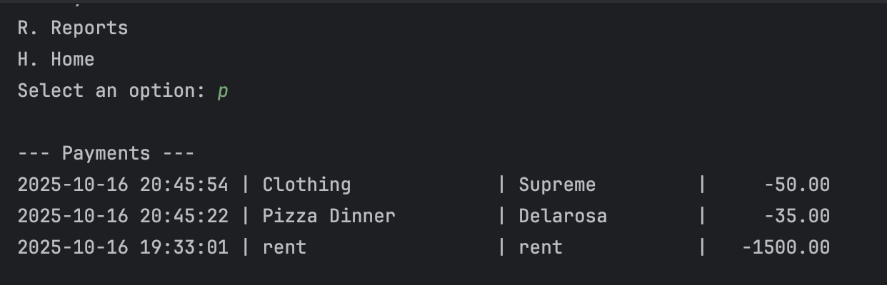
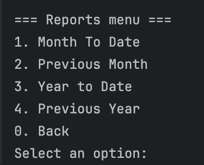
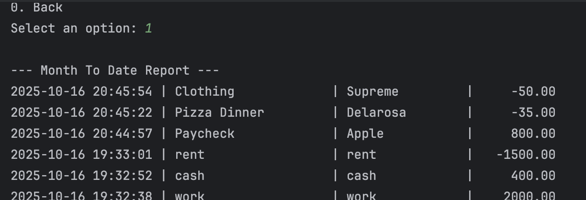
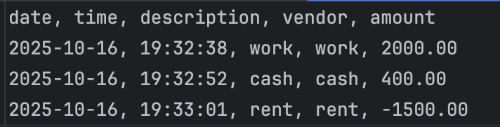

# Accounting Ledger

**Java Capstone Project**
Created by **Nayeli**

---

## Overview
This project is an Accounting Ledger appplication.
It lets a user record their **deposits** and **payments**, view their **ledger**, and run different **reports** to see transactions that fit a specific time or vendor. 

All the transactions are saved to a **CSV file**, which helps users find them even after the app has been exited out of. 

---

## Home Screen
When the app starts it shows a menu with options:

---

## Ledger Screen
The ledger screen allows users to view their transactions and filter them:

Transactions will show up in the order of **newest to oldest**

---

## Reports Screen
This screen lets users see their transactions from different times or by specific vendor:

---

## CSV File (transaction history)
All of the transactions in the program will be saved automatically in the file called 'transactions.csv'.

This is what the file looks like:

## Favorite Piece of Code
My displayLedger() method :)

I found this to be my most interesting piece of code because it's what lets users view all of their transactions. 
It neatly organizes everything and for me personally its nice to look at. It keeps track of 
the date, what the transactions were for, and an idea of how much money you have.

---
## Program Summary
The program includes all of the following 
- Home Screen 
- Ledger Screen
- Reports
- CSV File
- Transactions

